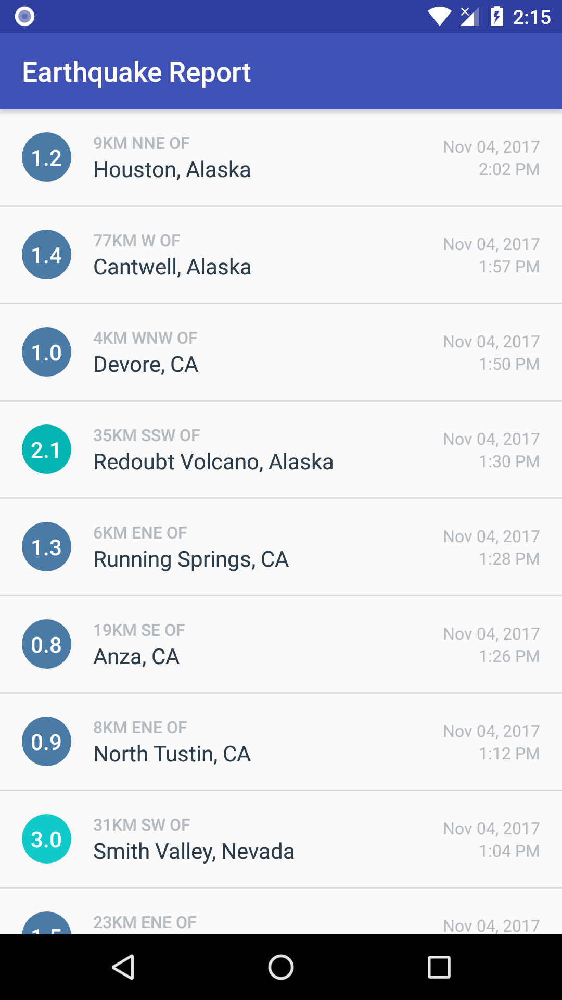

# Earthquake-Report
Android app that displays recent earthquakes from around the world, using USGS api. User can see magnitude, location and time of the event. The magnitude circle changes color, according to the severity of the earthquake.Used in a Udacity course in the Beginning Android Nanodegree. When you click on a earthquake, its web page in USGS is opened.
 

